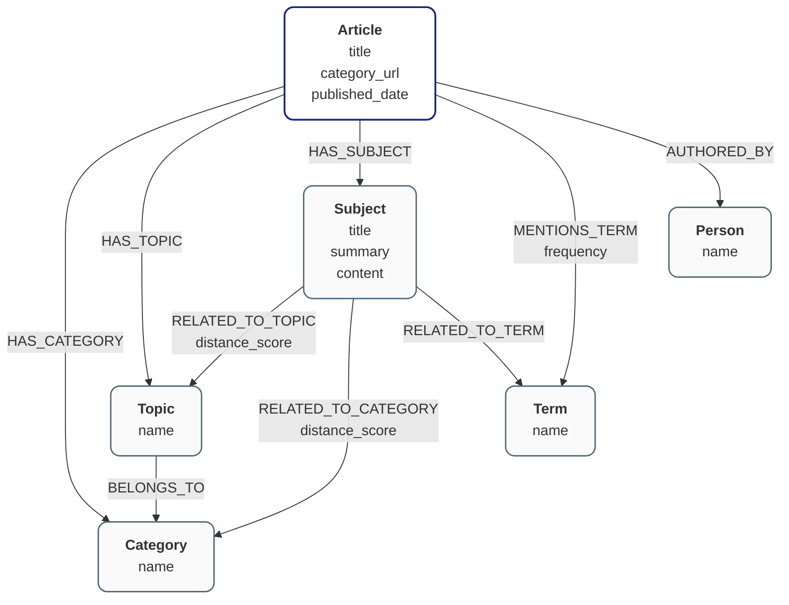

# Graph Data Model Diagram

(例)

```mermaid
graph TD
    %% 1. ノードの定義（タイトルを太字、属性は名称のみ）
    Article["<b>Article</b><br>title<br>category_url<br>published_date"]
    
    Category["<b>Category</b><br>name"]
    
    Topic["<b>Topic</b><br>name"]
    
    Subject["<b>Subject</b><br>title<br>summary<br>content"]
    
    Term["<b>Term</b><br>name"]
    
    Person["<b>Person</b><br>name"]

    %% 2. リレーションシップ（記事を起点とした関係）
    Article -->|HAS_CATEGORY| Category
    Article -->|HAS_TOPIC| Topic
    Article -->|HAS_SUBJECT| Subject
    Article -->|MENTIONS_TERM<br/>frequency| Term
    Article -->|AUTHORED_BY| Person
    
    %% 3. リレーションシップ（階層構造）
    Topic -->|BELONGS_TO| Category
    
    %% 4. リレーションシップ（主題からの関連）
    Subject -->|RELATED_TO_TOPIC<br/>distance_score| Topic
    Subject -->|RELATED_TO_CATEGORY<br/>distance_score| Category
    Subject -->|RELATED_TO_TERM| Term

    %% 5. デザイン調整（手書き風の白ベース）
    classDef default fill:#FAFAFA,stroke:#4A6572,stroke-width:1.5px,rx:10,ry:10;
    style Article fill:#FFFFFF,stroke:#1A237E,stroke-width:2px;
```
