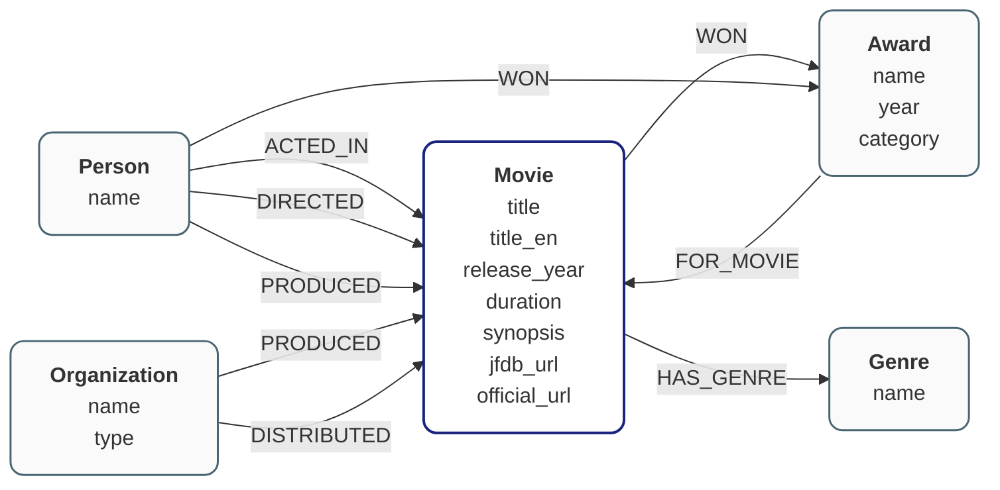
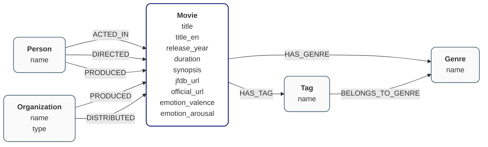
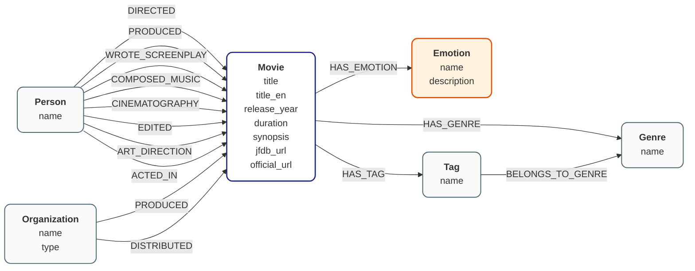

# Neo4j Graph Designer

`Neo4j Graph Designer` は、Claude Codeでグラフの設計からサンプルグラフ作成までを自動化したツールです。

## 🚀 概要

すべての作業は、Claude Code上で「〇〇して」と指示するだけでグラフモデリングのエキスパートのようにデータモデリングし、サンプルグラフの作成・評価を実現できます。

* **Step 1:** AI駆動による「グラフ設計書（デザインドック）」の作成
* **Step 2:** AI駆動による「グラフスキーマ」の作成
* **Step 3:** AI駆動による「グラフデータ」の抽出
* **Step 4:** Cypherクエリ生成・グラフ登録・評価

> ただし、ここで紹介している範囲は、**Step 1のみ**です。ご了承ください。

## 🛠 事前準備

* **AI ツール**: Claude Code

* **テンプレートのダウンロード**

```bash
git clone https://github.com/awk256/neo4j-lab-graph-designer.git
cd neo4j-lab-graph-designer
```

プロジェクトの構成は、以下の通りです。

```text
├── .claude 
├── .claude.json
├── README.md
├── images
├── inputs 
├── outputs 
├── logs 
└── settings.json
```

Claude Codeのテンプレートの構成は、以下の通りです。

```
.
├── .claude
│   ├── CLAUDE.md
│   ├── agents
│   │   └── graph-skill-designer.md
│   ├── knowledge
│   │   └── graph-design-baseline.md
│   ├── settings.json
│   └── skills
│       └── graph-skill-designer
│           ├── SKILL.md
│           └── graph-skill-template.md
└──  inputs
│   └── sample-data
│        ├── baian-movie.com.txt
│        ├── blueboy-movie.jp.txt
│        ├── gobangiri-movie.com.txt
│        ├── inuoh-anime.com.txt
│        └── migawari-movie.jp.txt
└── outputs
     └──  design-doc
        ├──  design-doc.md
        └──  design-doc.md.sample
```

## 📖 使用方法

### Step 1: デザインドックの自動作成

- Claude Codeで **デザインドックを作成して** と指示します。
- outputs/design-doc/design-doc.mdの中身を確認してみてください。
- 「**デザインドックからデータモデル図をmermaidで出力してください**」と指示してみてください。



- 一回目の実行で、はじめから100%期待どおりのグラフモデルを取得することはなかなか難しいものです。理想とする設計に近づけるために、デザインドックの改善を繰り返してください。

##### 1回目の指示(例)

```
グラフのデザインドックを作成して
```

##### 2回目の指示(例)

```
以下の内容をデザインドックに反映してください。

- 映画の内容を「ラッセルの感情円環モデル」を利用して感情分析し、その結果をプロパティに格納したい。感情は2次元空間（「快 - 不快」軸と「覚醒 - 睡眠」軸）で表現してください。
- 映画からタグ、タグからジャンル、映画からジャンルへの距離感をそれぞれスコアリング（0〜1）し、リレーションシップに格納してください。
- タグの例示は100種類用意してください。また、映画には3つ以上の複数のタグをマッピングしてください。
- ジャンルは30種類用意してください。各映画・タグからのジャンルへのマッピングは、最大3種類までに制限してください。
- アワード（Award）はエンティティから除外してください。
```



##### 3回目の指示(例)
```
以下のような内容をデザインドックに反映してください。
- 感情分析のノードをグラフモデルに追加してください。
- 感情分析の結果は、リレーションシップの属性にしてください。
```



このように、AIと対話を重ねながら自分の期待や意図、設計の観点を伝えるだけで、理想のグラフデータモデルがみるみる出来上がっていく実感が得られるはずです。